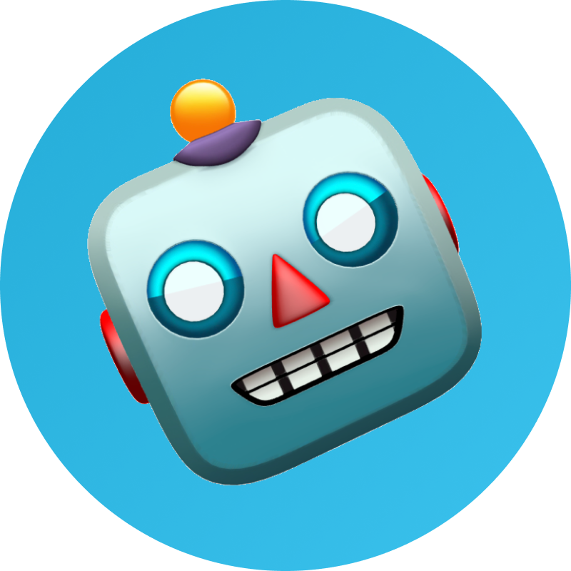

# VK Teams Bot API for Python
[](https://github.com/mail-ru-im/bot-python/actions/workflows/python-package.yml)
[](https://codecov.io/github/mail-ru-im/bot-python)
[](https://pkg.go.dev/github.com/mail-ru-im/bot-golang)


### [ VK Teams API Specification](https://teams.vk.com/botapi/)

## Getting started

* Create your own bot by sending the _/newbot_ command to _Metabot_ and follow the instructions.
    >Note: a bot can only reply after the user has added it to his contact list, or if the user was the first to start a dialogue.
* You can configure the domain that hosts your VK Teams server. When instantiating the Bot class, add the address of your domain.
* An example of how to use the framework can be seen in _example/test_bot.py_

## Installing
Install using pip:
```bash
pip install --upgrade mailru-im-bot
```

Install from sources:
```bash
git clone https://github.com/mail-ru-im/bot-python.git
cd bot-python
python setup.py install
```